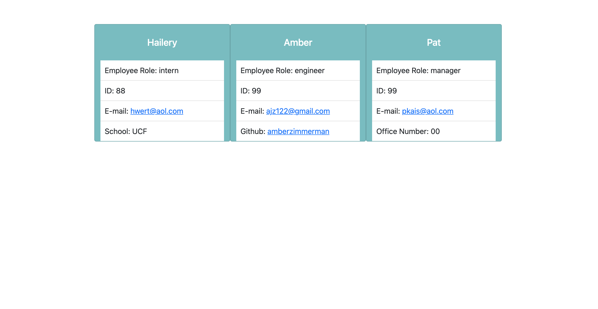

# Stacking Your Squad

### Link to video demo:

[Video demo link](https://drive.google.com/file/d/1dkVYjO1oYt4Z6aMn3xa9273rPobtBAv-/view?usp=sharing)

## Table of Contents:

- [Description](#description)
- [Installation](#installation)
- [Tests](#tests)
- [Questions](#questions)
- [Screenshots](#screenshot)

### Description of the project:

Stacking your squad is a Node.js command-line application that allows you to easily add members of your team with different roles and different stats. User is prompted with a series of questions that allows them to choose the role of their teammate. Every role has to answer the name, id, and email. Also, there will be at least one additional question based on the specific role. For example, manager will be prompted for the office number, engineer will be prompted for a github username, and intern will be prompted for a school name. Once finished, an html webpage will be generated with a user interface that displays the selected member roles and the answers to their questions. The email address will open in a new mail tab with the email address already populated. Also the github link will open to that users github.

### Installation:

Copy the SSH key from the code drop down in this repository, and then open it in terminal and clone it using git clone. Open the folder in VS code, and in integrated terminal install the following dependencies:
`npm i, npm jest, npm inquirer`

### Tests:

In order to test open the test folder in the console and run the following:
`npm run test`
There will be four tests, one for the general employee category, one for manager, one for engineer, and one for intern.

### Questions:

If you have any questions contact me on [GitHub](https://github.com/AmberZimmerman)

### Screenshot:

